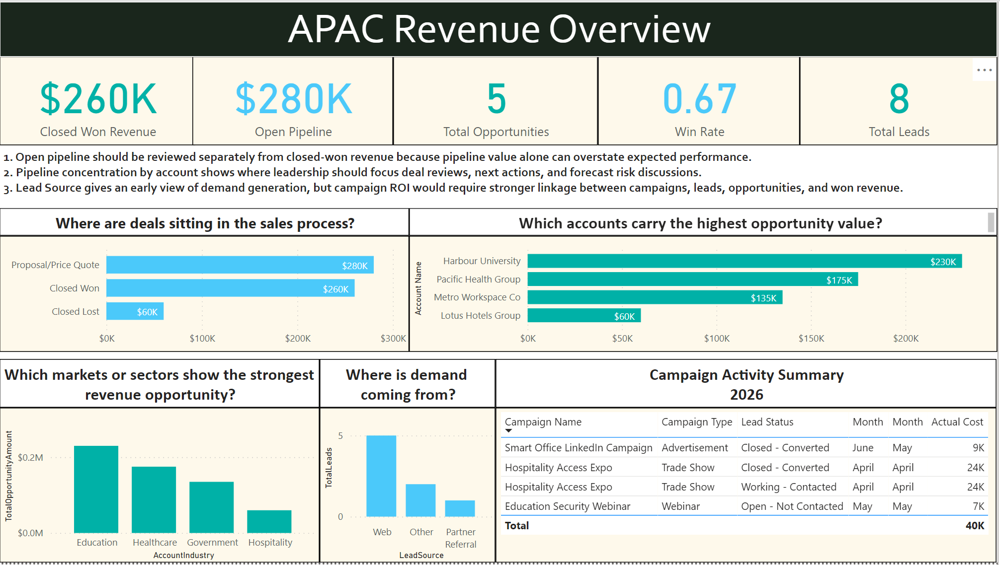

# APAC Revenue Dashboard

## Project Overview

This is a self-initiated Business Intelligence project built to understand how Salesforce-style CRM data can be transformed into executive-level commercial insights using Power BI.

The project uses dummy CRM data created in Salesforce across Accounts, Leads, Opportunities, and Campaigns. The data was exported from Salesforce Reports into CSV files and modelled in Power BI.

## Business Context

A regional leadership team needs better visibility into:

- Sales pipeline
- Closed-won revenue
- Win/loss performance
- Lead sources
- Campaign activity
- Account-level opportunity
- CRM data quality considerations

The goal of the dashboard is to help senior stakeholders quickly understand where revenue opportunities exist and where pipeline or reporting risks may need attention.

## Tools Used

- Salesforce Developer Org
- Salesforce Reports
- Power BI Desktop
- Power Query
- DAX
- CSV extracts

## Data Workflow

1. Created dummy CRM records in Salesforce.
2. Entered sample Accounts, Leads, Opportunities, and Campaigns.
3. Exported Salesforce Reports into CSV files.
4. Imported CSV files into Power BI.
5. Cleaned and transformed data using Power Query.
6. Built relationships between Accounts and Opportunities.
7. Created DAX measures for pipeline, revenue, win rate, and lead metrics.
8. Designed an executive dashboard for commercial visibility.

## Key Metrics

- Closed Won Revenue
- Open Pipeline
- Total Opportunities
- Win Rate
- Total Leads
- Lead Conversion Rate
- Pipeline by Stage
- Pipeline by Account
- Leads by Source
- Campaign Activity

## Key Learnings

This project reinforced that BI is not just about building visuals. The real value comes from understanding:

- How sales users enter CRM data
- How CRM data becomes reporting data
- Which fields are reliable for leadership reporting
- Where data quality issues can affect trust
- How to translate operational CRM activity into commercial insight

## Dashboard Preview

## Limitations

This project uses dummy sample data and is not connected to any real company system. The Power BI dashboard was built from Salesforce CSV exports due to connector authentication issues in the local setup.

## Future Improvements

- Add product-level analysis
- Add campaign-to-opportunity attribution
- Add forecast accuracy metrics
- Add opportunity ageing and stale deal indicators
- Build a more complete star schema model
